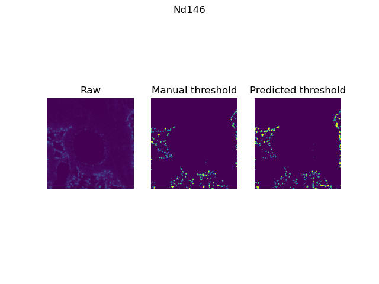
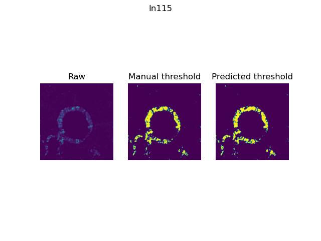

# DeepThresh
DeepThresh deep-learning approach created for the segmentation and thresholding of imaging mass cytometry (IMC) data within the landscape of lung tissues.

## Model
The model was built using Pytorch, with a ResNet encoder and UNet decoder and a single input channel corresponding to the channel of interest. In total 37 models were built and trained for each protein/channel.  

## Data 
The project focuses on imaging mass cytometry data, comprising 37 channels/proteins. The dataset includes 36 regions of interest, with six expert annotated by a biologist. For robust training, four images are for training, one for validation, and one for testing.

## Results 
Below are some example results: 

